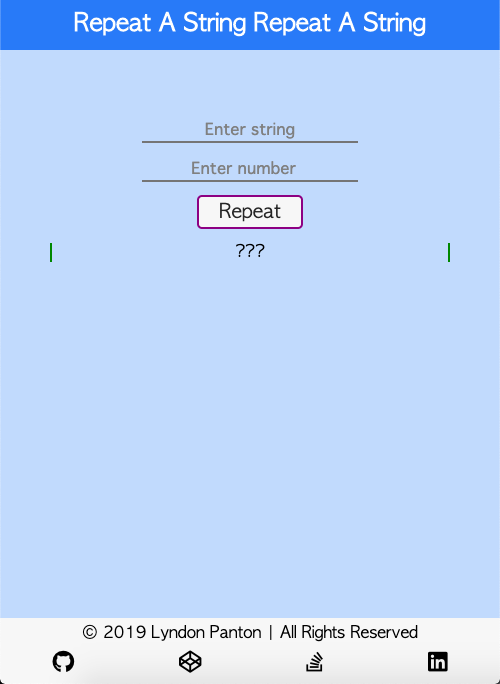
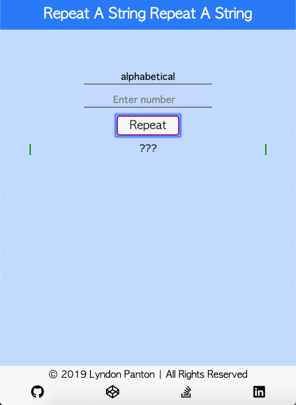
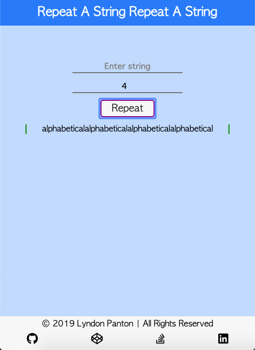
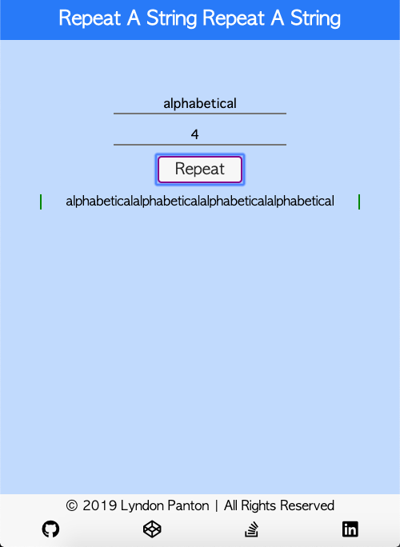
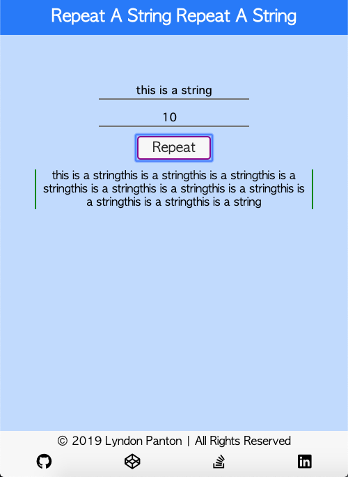

# Repeat A String Repeat A String

## How To Open
> 1. Go to the project's download folder
> 2. Right click on the file named _index.html_
> 3. Choose the _open with_ option
> 4. Open the project in your desired browse

## How To Use
> 1. Enter a string into the first input field
> 2. Enter an integral value greater than zero into the second input field
> 3. The string entered into the first input field will be repeated amount of times respective to the numbers in the second input field

## Requirements
> 1. This project requires a browser to run
> 2. The browser must have JavaScript available and enabled

## Extra Information
> 1. This was done for one of freecodecamp's Basic Algorithm Scripting activities

## Preview

